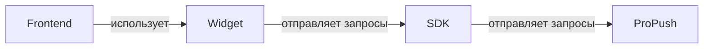
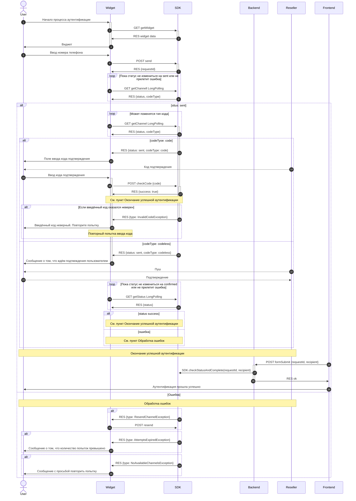

# Документация для разработчиков

## Общая информация 
Клиентские компоненты:
Для удобства работы есть уже готовыe компоненты:
- **UI Виджет** - фронтенд-компонент, который отображается пользователям
- **SDK** - серверная библиотека для интеграции

## Использование готового widget для фронтенда

[Подробная документация по подключению виджета](https://www.npmjs.com/package/@sigmamessaging/otp-widget)

## Написание своего widget

Для написания своего виджета он должен производить запросы на эндпоинты SDK ([API sdk](./api/sdk/index.md)) а так же следовать логике запросов которая показана на диаграмме работы.

## Использование готового SDK для бекенда

Для `NodeJs` доступен готовый SDK который предоставляем готовые методы для работы с API, а так же готовые контроллеры для работы с виджетом на фронтенде.

[Документация по SDK](./DOCS_SDK.md).

## Написание своего SDK

В готовом SDK для NodeJs из дополнительной логики есть только интеграция с captcha провайдерами. В остальном SDK только отправляет запросы на сервис ProPush (otp-handler). Так как API системы открытая то можно написать SDK на других языках. Для этого SDK должно будет отправлять запросы на сервис `otp-handler` ([API otp-handler](./api/otp-handler/index.md)) и обеспечить эндпоинты для виджета на фронте ([API sdk](./api/sdk/index.md)).

## Общая схема работы

### Диаграмма работы

Участники процесса
- User — конечный пользователь.
- Frontend - ваш фронтенд.
- Widget — фронтенд-виджет, интегрированный в ваш фронтентд.
- SDK — серверный SDK, выступающий прокси между виджетом и сервисом SIGMA.
- Backend — бэкенд-сервер вашего приложения.
- Reseller — сторонний сервис (e.g., SMS-провайдер, банковское приложение), доставляющий код или push-уведомление.

#### Инициализация виджета

1. Начало процесса аутентификации
2. Фронтенд запрашивает данные самого виджета [getWidget](./api/sdk/get-widget.md)

#### Запуск процесса аутентификации
5. Пользователь вводит номер телефона и запускает процесс аутентификации
6. Фронтенд отправляет запрос на запуск процесса аутентификации [send](./api/sdk/send.md)
7. Бекенд отправляет идентификатор процесса аутентификации и на стороне сервиса SIGMA начинается процесс выбора и запуска подходящего канала.
8. Фронтенд делает long polling запрос [getChannelLongPolling](./api/sdk/get-channel-long-polling.md) и ждёт пока статус канала не измениться на `sent` либо придёт ошибка.
10. Важно: Даже если в ответе от [getChannelLongPolling](./api/sdk/get-channel-long-polling.md) в пункте `8` пришёл `sent` опрос необходимо продолжать. В некоторых случаях система сервис SIGMA может динамически изменить канал с `code` на `codeless` (и наоборот) без изменения общего статуса `sent`.

#### Подтверждение по коду (`code`)

Тип канала `code` означает, что пользователь должен будет ввести код который придёт к нему. И этот код должен будет быть передан в SDK и дальше для проверки и фронтенд узнает об подтверждении сразу в ответе.

12. В случае ответа от [getChannelLongPolling](./api/sdk/get-channel-long-polling.md) что статус канала `sent` и тип канала `code`, фронтенд должен отрисовать поле ввода кода так как код подтверждения уже отправлен пользователю.
15. Пользователь вводит код подтверждения.
16. Фронтенд отправляет запрос на эндпоинт [checkCode](./api/sdk/check-code.md) для проверки кода.
17. Код отправленный на эндпоинт оказался верный и дальше см. пункт окончания процесса аутентификации.
18. Код отправленный на эндпоинт оказался неверный и вернулась ошибка `InvalidCodeException`. В данном случае надо сообщить пользователю об этом и начать заново с пункта `15`.

#### Подтверждение без кода (`codeless`)

Тип канала `codeless` означает, что пользователю приходит push или другой вариант подтверждения. Разница с подтверждением по коду в том, что подтверждение придёт уже напрямую в сервис SIGMA и фронтенд узнает об подтверждении при поможщи long polling запросов "ассинхроно".

20. Если после ответа от эндпоинта [getChannelLongPolling](./api/sdk/get-channel-long-polling.md) тип канала оказался `codeless` то пользователь не вводит код, а успешность аутентификации проверяется фронтендом с помощью long polling запроса [getStatusLongPolling](./api/sdk/get-status-long-polling.md).
24. Запрос на этот эндпоинт. И в зависимости от ответа - либо успешное окончание процесса аутентификации либо обработа ошибок.

    У канала `codeType` может измениться в процессе запроса, а статус `wait` означает, что запрос всё ещё в процессе.  Так же кроме смены `codeType` может может придти ответ `ChannelChangedException`. По этому запрос на `getChannel longPolling` надо делать постоянно. А ориентироваться надо на статус `sent` и этот статус означает что пользователю уже что-то отправлено. Так что, если статус `wait` то ждём независимо от типа канала. При смене статуса на `sent` :
    - если тип канала `code` то рисуем ввод кода
    - если тип канала `codeless` то отправляем long polling на проверку пуша

#### Успешное окончание процесса аутентификации.

Это критически важный шаг безопасности. Проверка итогового статуса и фиксация результата должны выполняться на стороне вашего сервера, а не фронтенда, чтобы избежать подделки запросов.

26. После успешного ответа на проверку кода [checkCode](./api/sdk/check-code.md) либо успешного ответа от [getStatusLongPolling](./api/sdk/get-status-long-polling.md) начинается процесс аутентификации который должен происходить на стороне бекенда и инициализирует её уже не виджет а фронтенд.
27. Бекенд вызывает метод SDK [checkStatusAndComplete](./docs/otp-sdk.sigmaotpsdk.checkstatusandcomplete.md) и сообщает об успешности аутентификации.

#### Обработка ошибок

30. При ошибке `ResendChannelException` необходимо сделать запрос на эндпоинт [resend](./api/sdk/resend.md) и тем самым перезапуститься текущий канал либо запуститься следующий. При ошибке `ChannelChangedException` надо заново вызвать getChannel что бы получить и отрисовать канал заново так как данный ответ возникает при попытке перезапуска текущего канала или при попытке запуска следующего канала (если попытки перезапуска текущего канала исчерпаны). При остальных ошибках конец процесса аутентификации и просьба начать процесс заново пользователю.

