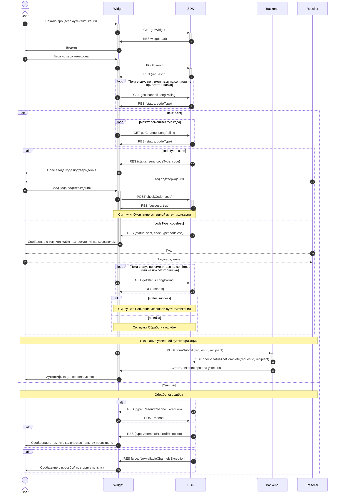

# Документация для разработчиков

- [Документация для backend разработчиков](./DOCS_FOR_BACKEND.md)
- [Документация для frontend разработчиков](./DOCS_FOR_FRONTEND.md)

## Общая схема работы

1. Начало процесса аутентификации
2. Фронтенд запрашивает данные самого виджета [getWidget](./api/sdk/get-widget.md)
5. Пользователь вводит номер телефона и запускает процесс аутентификации
6. Фронтенд отправляет запрос на запуск процесса аутентификации [send](./api/sdk/send.md)
7. Бекенд отправляет идентификатор процесса аутентификации и на стороне сервиса SIGMA начинается процесс выбора и запуска подходящего канала.
8. Фронтенд делает long polling запрос [getChannelLongPolling](./api/sdk/get-channel-long-polling.md) и ждёт пока статус канала не измениться на `sent` либо придёт ошибка.

Каналы бывают двух видов:
- `code` - Oбычный кодовый канал. Это означает, что пользователь должен будет ввести код который придёт к нему. И этот код должен будет быть передан в SDK и дальше для проверки и фронтенд узнает об подтверждении сразу в ответе.
- `codeless` - Безкодовый канал. В данном случае пользователю приходит push или другой вариант подтверждения. Разница в том, что подтверждение придёт уже напрямую в сервис SIGMA и фронтенд узнает об подтверждении при поможщи long polling запросов "ассинхроно".

10. Даже если в ответе от [getChannelLongPolling](./api/sdk/get-channel-long-polling.md) в пункте 8 пришёл sent то всё равно нельзя прекращать long polling запросы т.к. в некоторых случаях может поменяться тип канала с кодового на безкодовый без смены канала.
12. В случае ответа от [getChannelLongPolling](./api/sdk/get-channel-long-polling.md) что статус канала `sent` и тип канала `code`, фронтенд должен отрисовать поле ввода кода так как код подтверждения уже отправлен пользователю.
15. Пользователь вводит код подтверждения.
16. Фронтенд отправляет запрос на эндпоинт [checkCode](./api/sdk/check-code.md) для проверки кода.
