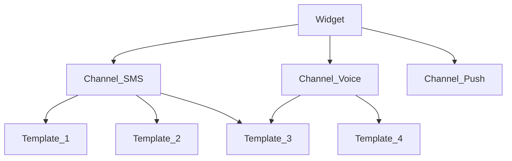

# Документация 

- [Административная документация для пользователей](./ADMIN_DOCS.md)
- [Административная документация для администраторов](./USER_DOCS.md)
- [Техническая документация (для разработчиков)](./DEVELOPER_DOCS.md)

## Общая информация 

### Конфигурационные сущности в платформе SIGMA:
- **Виджет** (настройки) - конфигурационный профиль, определяющий параметры работы виджета. К виджету может быть привязанно множество настроек каналов ранжированные по приоритету.
- **Канал** (настройки) - конфигурация способа доставки кода/подтверждения. К каналам может быть привязанно множество настроек шаблонов. 
- **Шаблон** (настройки) - конфигурация содержимого сообщения.

## Процесс работы системы
    *UI Виджет* это фронтенд-компонент, который отображается пользователям на сайте

1. Пользователь инициирует процесс верификации через **UI-виджет**.
2. **UI-виджет** запрашивает настройки из конфигурации виджета на платформе SIGMA.
3. Система выбирает подходящий канал по приоритету из привязанных к виджету. Если канал не подходит (произошла ошибка или нет подходящего шаблона) то выбирается канал следующий по приоритету.
4. Для выбранного канала система выбирает подходящий шаблон сообщения.
5. Сообщение отправляется пользователю через выбранный канал.
6. Пользователь подтверждает верификацию (вводом кода или иным способом).
7. Результат возвращается в систему и обрабатывается.
