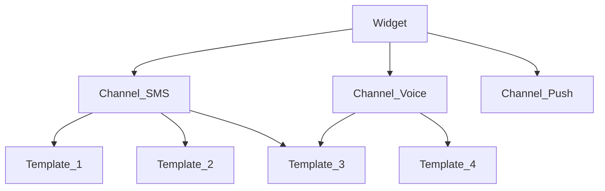

# Документация 

[Документация для пользователя](./DOCS_FOR_USER.md)
[Документация для администратора](./DOCS_FOR_ADMIN.md)
[Документация для программиста](./DOCS_FOR_PROGRAMMER.md)

## Общая информация 
В OTP есть следующие сущьности
- Виджет
- Канал
- Шаблон

### Виджет
К виджету привязываются каналы. 

### Канал
Канал - это настройка конкретного канала передачи кода, пуш, или любого другого варианта передачи данных для подтверждения номера телефона.
К каналу может быть привязанно множество шаблонов.
Каналы привязваются к виджету и ранжируются по приоритету.
В процессе аутентификации по конкретному виджету канал выбирается из числа привязанных к виджету и в зависимости от его приоритета привязки к виджету. И при ошибках в канале просиходят повторные поптыки отправки по данному каналу и при определённом количестве неудавшихся попыток запускается следующий канал.

### Шаблон
Шаблон - это настройка конкретного шаблона отправляемого сообщения пользователю при подтверждении номера телефона.
Шаблоны привязываются к каналу.
В процессе аутентификаци по конкретному каналу шаблон выбирается из числа привязанных к каналу по условиям настраиваимым в шаблоне в зависимости от номера телефона пользователя.
